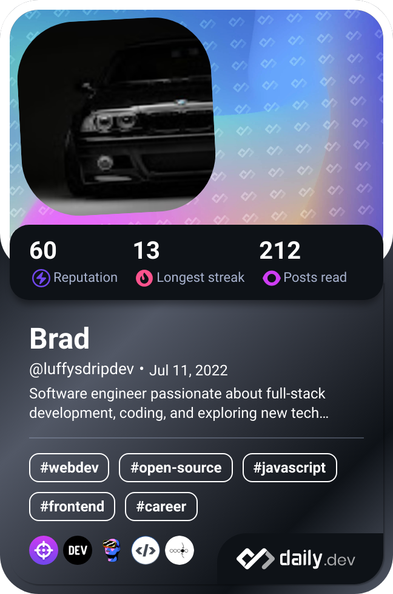

- 👋 Hi, I’m @luffybrad
- 👀 I’m interested in backend development i.e., NodeJS, PHP, Ruby
- 🌱 I’m currently sharpening my backend skills
- 💞️ I’m looking to collaborate on advanced web application development
- 📫 How to reach me ... @bradleykahoron399@gmail.com
<!--my devcard-->

<!---
luffybrad/luffybrad is a ✨ special ✨ repository because its `README.md` (this file) appears on your GitHub profile.
You can click the Preview link to take a look at your changes.
--->
